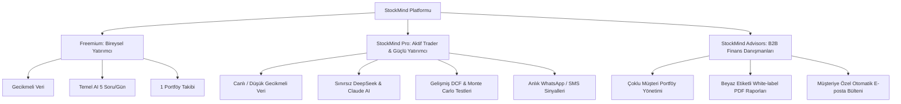

# 🚀 StockMind: FinTech Vizyonu, Yeni Nesil Özellikler ve İnovasyon Yol Haritası

> **Hazırlayan:** Antigravity AI — Kıdemli FinTech & Yazılım Mimarisi Danışmanı  
> **Tarih:** 17 Eylül 2026  
> **Dosya Konumu:** `STOCKMIND_VIZYON_VE_YENILIKLER_REHBERI.md`  
> **Hedef:** StockMind'ı yalnızca bir takip aracı olmaktan çıkarıp, Türkiye ve küresel piyasalarda yatırımcıların vazgeçilmezi olan **"Akıllı Finansal Terminal & Yapay Zeka Portföy Ekosistemi"** haline getirmek.

---

## 📌 Yönetici Özeti (Executive Summary)

StockMind; modern Next.js 16 mimarisi, Supabase veritabanı, zarif mor-karanlık cam (glassmorphic) arayüzü, TEFAS fon analizleri, interaktif ısı haritası ve OpenRouter yapay zeka entegrasyonuyla çok güçlü bir temele sahiptir.

Bu doküman; **Fintables, TradingView, Koyfin, Simply Wall St ve Bloomberg Terminal** gibi küresel devlerin güçlü yönlerini analiz ederek, StockMind'a eklenebilecek en çığır açıcı özellikleri, teknik gereksinimlerini ve iş modellerini kapsamlı bir şekilde sunar.

---

## 🏛️ 1. Derin Piyasa Verisi & Aracı Kurum Entegrasyonları (Brokerage Connectivity)

| Özellik | Açıklama | Değer & Etki |
| :--- | :--- | :--- |
| **Aracı Kurum Açık Bankacılık (Open Banking / Broker Sync)** | Midas, İş Yatırım, Garanti BBVA, Yapı Kredi, Gedik vb. aracı kurumlardaki hesapları SnapTrade veya Açık Bankacılık API'si ile bağlayarak portföyü otomatik içe aktarma ve canlı eşitleme. | Manuel işlem girişini sıfıra indirir, kullanıcı bağlılığını 10 katına çıkarır. |
| **Tek Tıkla Doğrudan Emir Gönderme (Direct Trading)** | StockMind üzerinden analiz yaparken doğrudan aracı kuruma BIST/ABD hissesi alım-satım emri iletme. | Uygulamayı salt bir takip aracından işlem platformuna dönüştürür. |
| **Canlı Kademe & Derinlik Analizi (Level 2 Data)** | BIST hisselerinde anlık alış/satış kademeleri, emir yoğunlukları ve derinlik grafiği. | Profesyonel günlük (day trader) ve swing yatırımcıları platforma çeker. |
| **AKD (Aracı Kurum Dağılımı) & Para Giriş/Çıkışı** | Hangi kurumun (BofA, Yatırım Finansman, İş vb.) o gün hangi hissede net alıcı veya satıcı olduğunu anlık gösteren takas akışı. | Türkiye borsasında en çok talep gören temel verilerden biridir. |
| **Takasbank Yabancı Payı & Saklama Oranları** | Hisselerdeki yabancı yatırımcı oranlarının haftalık/aylık değişim grafiği. | Kurumsal hareketleri önceden sezme avantajı sunar. |

---

## 🧠 2. Yapay Zeka & Çoklu Ajan Tabanlı Yatırım Komitesi (Multi-Agent AI Hub)

### 2.1. "Yatırım Komitesi" Çoklu AI Simülasyonu
Kullanıcı bir hisseyi (örn: `THYAO` veya `NVDA`) seçtiğinde, 4 farklı yatırım efsanesini temsil eden yapay zeka ajanları canlı bir panelde tartışır:
1. **Warren Buffett Ajanı:** Hendek (Moat), serbest nakit akışı, fiyat/defter değeri ve borçluluk odaklı bakar.
2. **Peter Lynch Ajanı:** Büyüme potansiyeli, PEG rasyosu ve günlük hayat trendlerine göre yorumlar.
3. **Jim Simons / Quant Ajanı:** RSI, MACD, volatilite, momentum ve algoritmik sinyalleri değerlendirir.
4. **Risk Yöneticisi (Ayı Senaryosu):** Olası kriz senaryolarını, sektörel riskleri ve maliyet açıklarını öne sürer.
* **Sonuç:** Komitenin ortak ağırlıklı **"Konsensüs Raporu"** ve risk puanı üretilir.

### 2.2. KAP Bildirimlerini Anlık AI ile Yorumlama (Real-time KAP Intelligence)
* KAP'a (Kamuyu Aydınlatma Platformu) yeni bir şirket haberi düştüğü an (örn: Yeni iş ilişkisi, sermaye artırımı, dava sonucu):
* AI, bildirimi 3 saniyede tarar:
  - **Duygu / Etki:** Pozitif 🟢 / Nötr 🟡 / Negatif 🔴
  - **Hap Özet:** 3 maddede bildirimin şirketin finansallarına beklenen ciro/kâr etkisi.
  - İlgili hisseyi takip eden kullanıcılara anlık mobil push bildirim.

### 2.3. Faaliyet Raporu & Çeyreklik Bilanço AI Özetleyicisi
* Şirketlerin 80-120 sayfalık faaliyet raporlarını ve dipnotlarını tek tıkla analiz edip **"Yatırımcının Bilmesi Gereken 5 Kritik Madde"** halinde infografik çıktısı üretme.

---

## 📊 3. İleri Seviye Temel & Kantitatif Değerleme Modelleri (Quant Lab)

1. **Otomatik DCF (İndirgenmiş Nakit Akımı) Motoru:**
   - Gelecek 5 yıllık nakit akış tahminleri, AOMM (WACC) ve nihai büyüme oranına göre hissenin **"İçsel Adil Değeri" (Fair Value)** hesaplama.
   - "Şu anki fiyat adil değerinin %24 altında (İskontolu)" göstergesi.
2. **Finansal Sağlık & Güvenlik Skorları:**
   - **Piotroski F-Score (0-9):** Şirketin kârlılık, kaldıraç ve operasyonel verimlilik gücü.
   - **Altman Z-Score:** Şirketin önümüzdeki 2 yıl içinde iflas riski taşıyıp taşımadığı.
   - **Beneish M-Score:** Finansal tablolarda kâr manipülasyonu veya makyajlama olasılığı.
3. **Temettü Emekliliği Simülatörü & DRIP Hesaplayıcı:**
   - "Ayda 5.000 ₺ temettü hissesi alırsam ve temettüleri tekrar yatırırsam (DRIP), 5, 10 ve 15 yıl sonra aylık ne kadar pasif gelir elde ederim?" interaktif eğrisi.
4. **DuPont Analiz Ağacı:**
   - Özkaynak Kârlılığını (ROE) Net Kâr Marjı × Aktif Devir Hızı × Finansal Kaldıraç bileşenlerine ayırarak şirketin kârının kalitesini görselleştirme.

---

## 🛡️ 4. Portföy Risk Yönetimi & Stres Testi Simülatörü

* **Monte Carlo Portföy Simülasyonu:**
  - Portföyün geçmiş volatilite ve korelasyon matrisini kullanarak 10.000 farklı piyasa simülasyonu yürütme.
  - Yatırımcıya %95 güven aralığında en kötü (%5 VaR) ve en iyi senaryo portföy büyüklüğü tahminleri.
* **Makro Kriz Stres Testleri:**
  - *"Dolar kuru ₺48'den ₺60'a fırlarsa portföyüm nasıl etkilenir?"* (Döviz pozisyonu ve döviz açığı olan şirketlerin anlık stres testi).
  - *"Merkez Bankası faizi 500 baz puan indirirse/artırırsa ne olur?"*
  - *"Küresel resesyonda petrol fiyatı %25 düşerse hangi varlıklarım korur?"*
* **Otomatik Portföy Rebalans / Dengeleme Danışmanı:**
  - Markowitz Modern Portföy Teorisi (Etkin Sınır) kullanarak kullanıcının mevcut sepetindeki riski düşürüp Sharpe oranını maksimize eden yeni ağırlık önerisi.

---

## 🌐 5. Sosyal Yatırım & Topluluk Ağı (Social & Copy-Trading)

1. **Doğrulanmış Yatırımcı Rozetleri (Verified Portfolios):**
   - Kullanıcıların aracı kurum entegrasyonuyla doğrulanan gerçek getiri oranları (Gizlilik gereği lot sayısı gizlenebilir, sadece getiri %'si ve sektörel dağılım gösterilir).
2. **"Copy-Allocation" (Sepet Kopyalama):**
   - Başarılı fon yöneticilerinin veya topluluk liderlerinin TEFAS/Hisse sepet dağılımlarını tek tıkla kendi portföyüne uyarlama.
3. **Hisseye Özel Canlı Yatırımcı Forumu & Duygu Analizi (Sentiment Index):**
   - Her hissenin ve fonun altında TradingView benzeri teknik çizim paylaşımı ve fikir teatisi alanı.
   - Twitter/X, Ekşi Sözlük ve finans haberlerinden taranan canlı **"Boğa/Ayı Duyarlılık Endeksi" (%74 Boğa - İyimser)**.

---

## 📱 6. Çoklu Cihaz, Mobil & Canlı Entegrasyon Ekosistemi

1. **WhatsApp & Telegram AI Finans Botu:**
   - Kullanıcının WhatsApp veya Telegram üzerinden StockMind botuna mesaj atması:  
     `"Portföyüm bugün ne yaptı?"` &rarr; Anlık portföy özeti ve kâr/zarar kartı.  
     `"THYAO analiz"` &rarr; Anlık grafik, destek/direnç ve AI sinyal özeti.
2. **iOS & Android Kilit Ekranı / Dynamic Island Widget'ları:**
   - Telefonun kilidini açmadan Dynamic Island veya Always-on-Display üzerinde anlık portföy değeri ve günün en çok kazandıran hissesi.
3. **Apple Watch & WearOS Komplikasyonları:**
   - Akıllı saat kadranında güncel BIST 100 endeksi, portföy getirisi ve kritik fiyat alarmları.
4. **Sesli Komut Entegrasyonu (Siri / Google Asistan Kestirmeleri):**
   - *"Hey Siri, StockMind günlük bültenimi oku."*

---

## 💼 7. Gelir Modelleri & B2B / SaaS Monetizasyon Stratejisi

* **StockMind Pro (Aylık/Yıllık Abonelik):**
  - Sınırsız AI analizi, gelişmiş bilanço çarpanları, sınırsız portföy ve döviz kriz stres testleri.
* **Otomatik Vergi & Beyanname Asistanı:**
  - Eurobond faiz gelirleri, yabancı hisse temettüleri ve TEFAS fon kazançları için Türkiye Gelir Vergisi beyannamesi taslağını otomatik hazırlayan ek modül.
* **B2B StockMind Finansal Danışman Paneli:**
  - Portföy yöneticilerinin ve bağımsız mali danışmanların onlarca müşterisinin varlığını tek panelden izleyip kurumsal PDF raporu üretebilmesi.

---

## 🗓️ 8. Aşamalı Yol Haritası (Implementation Roadmap)

### 🟢 Faz 1: Hemen Yapılabilecekler (Quick Wins - 1-2 Ay)
- [ ] BIST KAP bildirimlerini çeken ve AI ile 3 maddede özetleyen bildirim kartı modülü.
- [ ] Temettü takvimi ve yaklaşan genel kurul/bedelli-bedelsiz takvimi sayfası.
- [ ] Piotroski F-Score ve Altman Z-Score temel analiz kartları.
- [ ] Portföy için PDF dışa aktarma (Yatırımcı Portföy Raporu).

### 🟡 Faz 2: Yapay Zeka & Analitik Derinleşmesi (3-4 Ay)
- [ ] 4 Ajanlı "Yatırım Komitesi" AI tartışma ekranı.
- [ ] Otomatik DCF (İskonto Edilmiş Nakit Akımı) hedef fiyat hesaplayıcı.
- [ ] Twitter/X ve piyasa duygu (sentiment) analiz çubuğu.
- [ ] Telegram bildirim ve sorgulama botu entegrasyonu.

### 🟣 Faz 3: Aracı Kurum & Canlı Veri Genişlemesi (5-8 Ay)
- [ ] Aracı kurum hesap eşitleme (SnapTrade / Open Banking API).
- [ ] Canlı kademe / derinlik ve aracı kurum dağılımı (AKD) veri katmanı.
- [ ] Monte Carlo portföy stres testi ve rebalans optimizasyonu.
- [ ] iOS App Store & Google Play resmi mağaza yayını (PWA / Capacitor / React Native).

### 🔴 Faz 4: Sosyal Borsa & Kurumsal Çözümler (9-12 Ay)
- [ ] Doğrulanmış portföy lider tablosu ve Copy-Allocation ağı.
- [ ] StockMind Advisors B2B kurumsal danışman yönetim paneli.
- [ ] Otomatik Vergi & Beyanname hesaplama sihirbazı.

---

## 🎯 Sonuç ve Değerlendirme

StockMind, Türkiye'de ve gelişmekte olan piyasalarda **bireysel yatırımcının profesyonel fon yöneticisi seviyesinde kararlar almasını sağlayan** benzersiz bir platform olma potansiyeline sahiptir.

Bu dokümandaki inovasyonlar hayata geçirildiğinde StockMind:
1. Kullanıcıların her sabah piyasa açılmadan ve her akşam 18:30 seans kapanışında ilk açtığı finansal merkez üssü haline gelecektir.
2. Basit bir tablodan, karar alan ve yatırımcıyı koruyan **otonom bir finansal zekaya** dönüşecektir.
